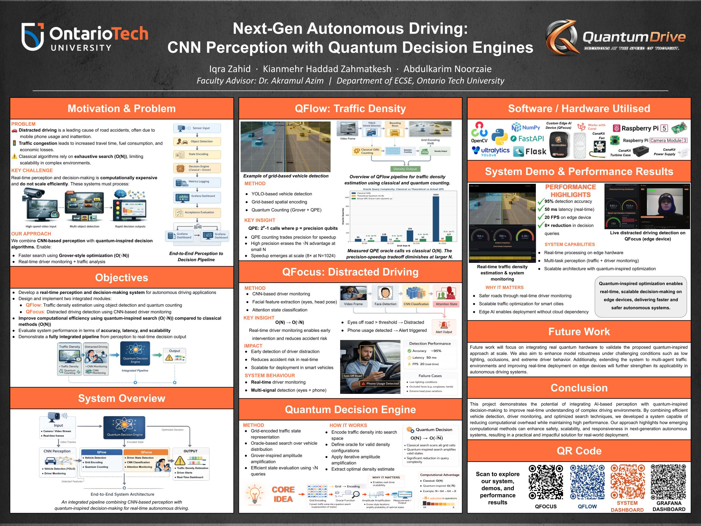

# QuantumDrive — Capstone Monorepo

Capstone project exploring **hybrid classical–quantum algorithms for autonomous driving and traffic perception**, with an end-to-end demo stack covering planning, perception, and a remote control dashboard.

> **Author:** Kian Haddad
> **License:** [MIT](LICENSE)

---

## Poster



## Demo

End-to-end walkthrough of the **QDrive dashboard** controlling the **QFlow quantum traffic density** pipeline on a remote device:

https://github.com/user-attachments/assets/1277dc86-f55b-48b7-89c4-b99ab964d967

> Prefer a download? [Grab the file here](assets/demo.mp4).

---

## Repository Layout

This is a monorepo of three subprojects developed across two semesters:

| Path | Project | Stack |
|---|---|---|
| [`semester-1-planning/`](semester-1-planning) | **Quantum-Assisted Decision Making** for autonomous driving — Grover's search over candidate acceleration profiles, validated in CARLA. | Python · Qiskit · CARLA |
| [`semester-2-qflow/`](semester-2-qflow) | **QFlow — Quantum Traffic Density Estimation** using Quantum Phase Estimation + Grover counting on YOLO occupancy grids. | Python · Qiskit · YOLOv8 · Flask |
| [`semester-2-dashboard/`](semester-2-dashboard) | **QDrive Dashboard** — remote control panel for two device agents (Home PC + Raspberry Pi) with live MJPEG previews. | Nuxt 4 · Nuxt UI v4 · Nitro |

Each subproject has its own `README.md` with detailed setup, CLI reference, and architecture notes. For the cross-cutting story — runtime flows, engineering decisions, and a cold-read order — see [ARCHITECTURE.md](ARCHITECTURE.md).

---

## Semester 1 — Quantum-Assisted Planning

Formulates trajectory selection as a **discrete search over candidate acceleration profiles** (`keep`, `comfort_brake`, `hard_brake`, `creep`), each scored by a physics-based cost function combining safety, comfort, and tracking terms.

- **Classical planner:** brute-force evaluation — O(N)
- **Quantum planner:** Grover's search over the same candidates — O(√N)
- **Result:** across 120 planning snapshots, the Grover-based solver matched the classical planner's decision in **100% of cases**, confirming the correctness of the quantum encoding and oracle.

See [`semester-1-planning/README.md`](semester-1-planning/README.md) for the cost function, architecture diagram, and scalability discussion.

---

## Semester 2 — QFlow (Quantum Traffic Density)

Divides a video frame into a grid of regions, uses YOLOv8 to mark occupied cells, and applies **Quantum Counting** (Grover operator + QPE) to estimate density.

- Theoretical complexity: classical O(N) vs quantum O(√N) oracle queries
- Per-frame logging of classical vs quantum counts, circuit depth, transpile time, and estimated speedup
- Optional Grafana Cloud push for live dashboards
- Device-agent (`Flask`) exposes `/status`, `/start`, `/stop`, `/video_feed` for remote control

See [`semester-2-qflow/README.md`](semester-2-qflow/README.md) for CLI reference, environment variables, and the academic-honesty notes on the oracle assumption.

---

## Semester 2 — QDrive Dashboard

Nuxt 4 web app that controls two remote device agents over HTTP, proxied through Nitro server routes to avoid CORS.

- Per-device Online/Offline + Running/Stopped status
- Start / Stop / Refresh per device, plus global controls
- Live MJPEG preview via each agent's `/video_feed`
- Timestamped event log + toast notifications
- Polls device status every 8 seconds

See [`semester-2-dashboard/README.md`](semester-2-dashboard/README.md) for the API contract and setup.

---

## Quick Start

Each subproject is independently runnable. Common entry points:

```bash
# Semester 1 — quantum planning (CARLA simulation)
cd semester-1-planning && pip install -r requirements.txt

# Semester 2 — QFlow quantum demo (no video required)
cd semester-2-qflow && pip install -r requirements.txt
python -m src.quantum.demo

# Semester 2 — Dashboard
cd semester-2-dashboard && npm install && npm run dev
```

---

## Tech Stack Summary

- **Quantum:** Qiskit (Grover, QPE, Aer simulator)
- **Perception:** YOLOv8 (Ultralytics) with optional CUDA acceleration
- **Simulation:** CARLA
- **Backend:** Python, Flask (device agents)
- **Frontend:** Nuxt 4, Nuxt UI v4, Tailwind
- **Observability:** Grafana Cloud (optional metrics push)

---

## License

Released under the [MIT License](LICENSE).
